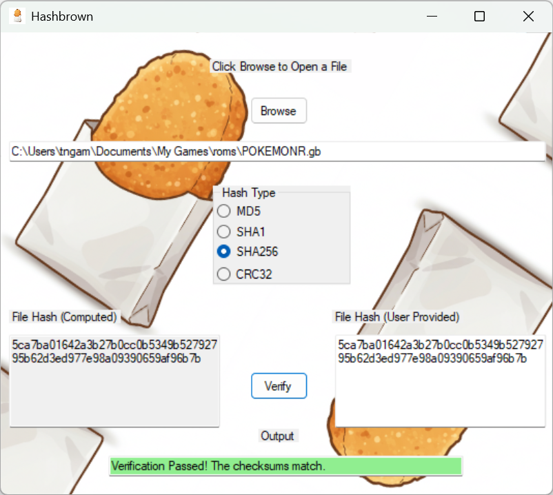
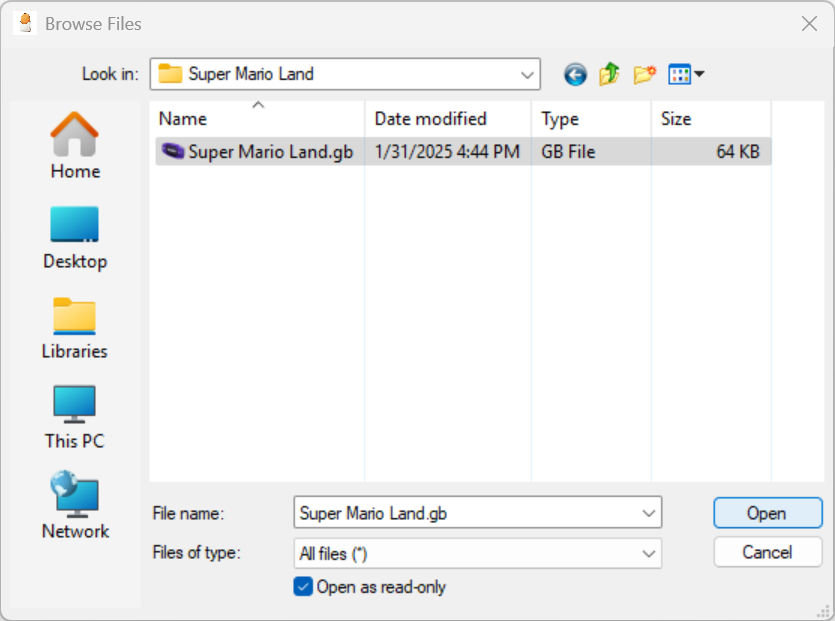
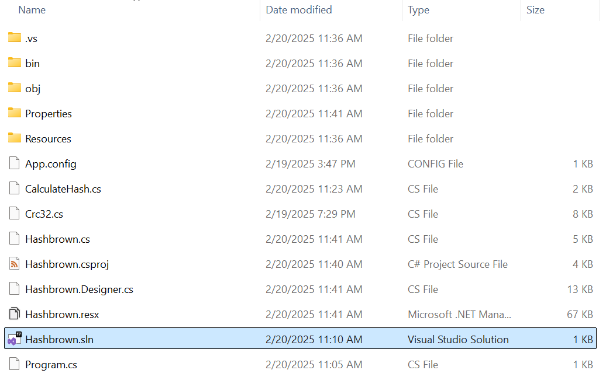
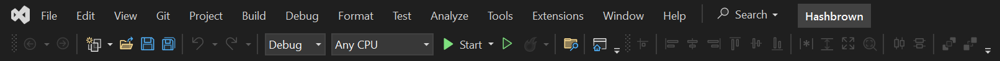

# hashbrown
You haven't eaten breakfast yet and you're craving hashbrowns but still have to work? This is the application for you! With hashbrown, you can verify your files with various checksum options to ensure you have the correct file and it's not corrupted.

## Compatibility
* Windows (Microsoft .NET Framework 4.7.2 or later)
* [Wine 10.0](https://www.winehq.org/)

## Features
* Native Windows
* Simple UI
* Output section includes helpful messages

## Algorithms
* MD5
* SHA1
* SHA-2 (SHA-256)
* CRC32

## Download

### Go to [Releases](https://github.com/Adobe-Android/hashbrown/releases), download the .exe file, and run. Enjoy :)

## Additional Installation Steps for macOS
Refer to [WineHQ Wiki - MacOS](https://gitlab.winehq.org/wine/wine/-/wikis/MacOS) for any additional help or context.

The latest version of wine (10.0) only supports macOS Catalina (10.15.4) or later, wine also works on Apple Silicon systems via Rosetta2.
It is recommended that you install Wine with a package manager like Homebrew or MacPorts.
Choose just one and then copy & paste the associated instruction from here and into your terminal of choice.

### Install Homebrew
```
/bin/bash -c "$(curl -fsSL https://raw.githubusercontent.com/Homebrew/install/HEAD/install.sh)"
```
See [Homebrew Docs - Installation](https://docs.brew.sh/Installation) for more details.

### Install MacPorts
See [MacPorts - Download & Installation](https://www.macports.org/install.php) for details.

> [!IMPORTANT]
> You will need to install Homebrew or MacPorts first before proceeding with either command below.

### Homebrew
```
brew install --cask --no-quarantine wine-stable
```

### MacPorts
```
sudo port install wine-stable
```

## Screenshot


## Usage
1. Click the "Browse" button located at the top center of the program
2. This will launch a new open file dialog window
3. Select a file by navigating to the one you want and clicking on it
4. Then click "Open" in the menu



5. Select a "Hash Type" by clicking one of the radio button options
6. The selected file's hash will be generated and visible in the lower left text box - labeled as "File Hash (Computed)" within the program
7. Paste a source provided hash in the lower right text box (usually from wherever you downloaded the file) - labeled as "File Hash (User Provided)" within the program
8. Click the "Verify" button - located between the two lower text boxes labeled as "File Hash (Computed)" and "File Hash (User Provided)" within the program
9. Check that the program section labeled "Output", positioned directly below the "Verify" button, has a message that says "Verification Passed! The checksums match." - the program output background also changes to light green to indicate a successful result
10. If you instead see a message that says "Verification Failed! The checksums do not match.", your file may be corrupt, the file you intended to download may have been tampered with, or you may need to verify that you have the right combination of hash and file downloaded

> [!NOTE]
> On macOS, copy and paste within the program may not operate like you are accustomed to.
> `command + c` and `command + v` do not work as expected and you must instead use `control + c` and `control + v` for copy and paste shortcuts.

## Development

### Requirements
Visual Studio 2022 (with .NET desktop development workload)

### Clone the repo
```
git clone git@github.com:Adobe-Android/hashbrown.git
```
### Open the solution (.sln) file in Visual Studio


### Run
Click Start in the Visual Studio menu (the green play button)



## Libraries
[DamienGKit CRC32](https://github.com/damieng/DamienGKit/blob/master/CSharp/DamienG.Library/Security/Cryptography/Crc32.cs)

## Resources
[No-Intro](https://datomatic.no-intro.org/index.php)
